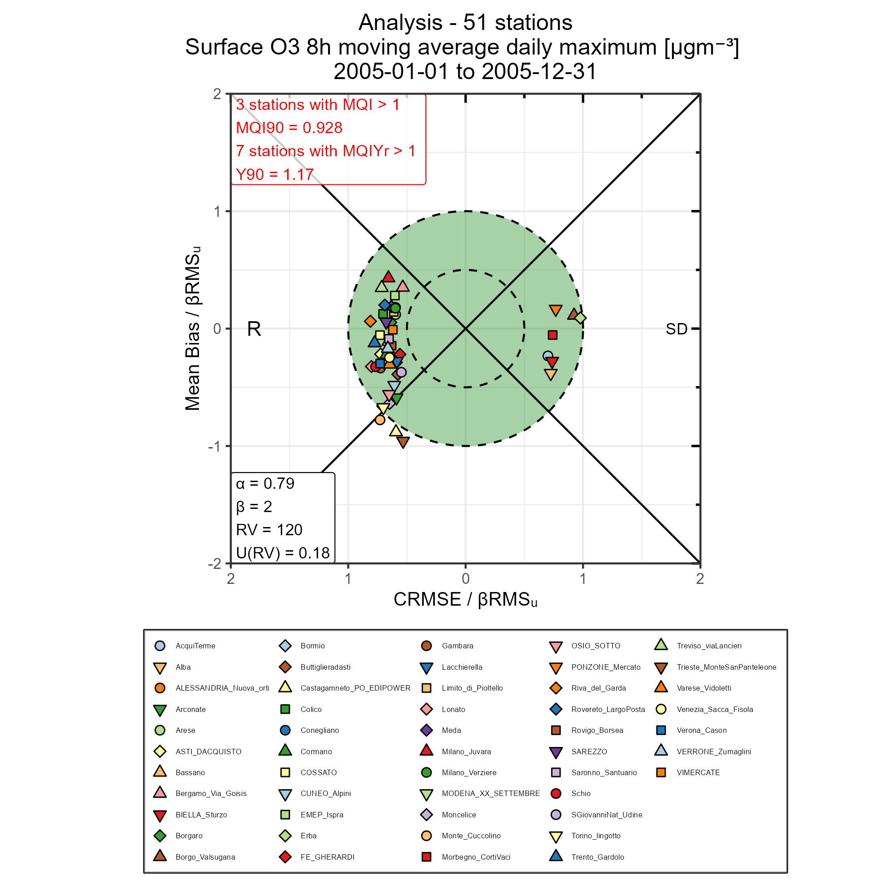

# FAIRMODE-Plots
An `R`-toolkit of functions for the evaluation of air quality models. The toolkit is able to create target diagrams and summary reports of analysis/assessment data and is inspired by the `DELTA` tool and the work of `FAIRMODE` in general. 

`FAIRMODE-Plots` has many similarities with the `R`-toolkit `dartle` (https://github.com/jobonaf/dartle) which also features functionalities to create target diagrams and summary reports. `dartle` has not been updated in many years and has some noticeable limitations. These are some of the primary drivers behind the development of `FAIRMODE-Plots`. 

Currently, it is not possible to create target diagrams and summary reports for forecast data but this will be added in the near future. 

For `FAIRMODE-Plots` to work, a newer version of `R` is required (it has only been tested with version 4.3.3) and the packages `ggplot2`, `RColorBrewer`, `ggprism`, `patchwork`, `cowplot`, `dplyr`, `zoo`, `stringr`, `data.table`, `tidyr`, `lubridate`, `ncdf4`, and `DescTools`.

# Usage

The script `FAIRMODE_Evaluation.R` contains the typical workflow of creating target diagrams and summary reports from data. The functions `ProgramInitialization()`, `ReadDELTAData()`,  `FormatDELTAData()`, `FAIRMODEStat()`, `SummaryReport()`, and `TargetPlot()` are defined in the script `FAIRMODE_Evaluation_functions.R`. 

# Examples

Demo data (from the `DELTA` tool) with observed and modeled concentrations are available and showcased in the script `Demo.Rmd`. 

# References

* Janssen, S., Thunis, P., FAIRMODE Guidance Document on Modelling Quality Objectives and Benchmarking (version 3.3), EUR 31068 EN, Publications Office of the European Union, Luxembourg, 2022, ISBN 978-92-76-52425-0, doi:10.2760/41988, JRC129254.
* Thunis, P., Cuvelier, C., DELTA Version 7.0 - Concepts / User's Guide / Diagrams, 2022.
